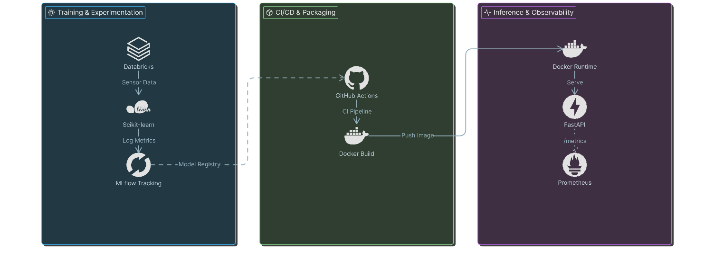

# TurbineMLOps

**Enterprise MLOps for predictive engine maintenance (RUL).** Training and experiment tracking on **Databricks / MLflow**. Inference and observability on **FastAPI**. Release discipline via **Docker** and **GitHub Actions**.

[](https://github.com/momo-s15/turbine-mlops/actions/workflows/ci.yml)
[](https://www.python.org/downloads/)
[](https://flake8.pycqa.org/)

---

## Executive summary

Unplanned engine maintenance drives operational risk, schedule disruption, and cost across aviation and aerospace programs. **TurbineMLOps** is an end-to-end **Machine Learning Operations (MLOps)** pipeline that estimates **Remaining Useful Life (RUL)** for turbofan-class assets from sensor telemetry and exposes that capability as production-grade software.

This is the full path from experiment to served inference: reproducible training, **centralized experiment and model lineage** through **MLflow on Databricks**, a **typed HTTP inference surface** on **FastAPI**, **containerized** deployment, **automated CI**, and **Prometheus-compatible** runtime metrics on the serving layer.

---

## Architecture and data flow

Training and serving are **decoupled**. Each side moves on its own cadence while honoring a single contract: the serialized model artifact and the inference request schema.


| Stage | What happens |
|--------|----------------|
| **Data** | Synthetic **CMAPSS-inspired** sensor streams (static pressure, core speed) with a physically grounded **RUL** target. Full control of the training distribution without shipping proprietary fleet data. |
| **Train & track** | **Scikit-learn** `RandomForestRegressor`. **RMSE** and parameters logged to **Databricks-managed MLflow**. Model serialized for sklearn inference. |
| **Serve** | **FastAPI** plus **Pydantic** validation, low-latency **RUL** responses, **Prometheus** counters and latency histograms at **`/metrics`**. |
| **Ship** | **Docker** image with a pinned runtime. **GitHub Actions** runs **flake8**, **pytest**, and a **Docker build** on every push. |

---

## Technology stack

| Layer | Stack |
|--------|--------|
| **ML** | scikit-learn, pandas, NumPy, joblib |
| **MLOps / tracking** | Databricks, MLflow |
| **API** | FastAPI, Uvicorn, Pydantic |
| **Observability** | prometheus-client |
| **Quality & CI** | pytest, httpx, flake8, GitHub Actions |
| **Containers** | Docker (`python:3.10-slim`) |

---

## Platform surface

- **Databricks for training, Docker for inference:** Clear separation between experiment compute and the deployable serving unit.
- **CI-gated inference code:** **flake8** plus **pytest** on every change. The API is tested software, not an untyped script wrapped around a pickle.
- **Production-style telemetry:** **Prometheus** instrumentation on request volume and inference latency, alongside offline **RMSE** from training.

---

## Repository layout

| Path | Role |
|------|------|
| `turbine_mlops/` | Shared training code: synthetic data generator and `train_model`. |
| `train.py` | Local training CLI. Writes `app/model/turbine_mlops_model.pkl`. |
| `app/main.py` | FastAPI application: `/predict`, `/health`, `/metrics`. |
| `databricks/notebooks/turbine_mlops_train.py` | Databricks notebook: MLflow experiment, `log_model`, optional registry. |
| `.github/workflows/ci.yml` | **TurbineMLOps CI:** install, flake8, train-for-tests, pytest, Docker build. |
| `Dockerfile` | Dependency install, `train.py` at image build, **uvicorn** entrypoint. |

---

## Quick start

**Clone**

```bash
git clone https://github.com/momo-s15/turbine-mlops.git
cd turbine-mlops
```

**Python environment**

```bash
python -m venv .venv
# Windows
.venv\Scripts\activate
# macOS / Linux
source .venv/bin/activate

pip install -r requirements.txt -r requirements-dev.txt
```

**Train**

```bash
python train.py
```

**Run the API**

```bash
uvicorn app.main:app --reload --host 127.0.0.1 --port 8000
```

| Endpoint | Method | Purpose |
|----------|--------|---------|
| `/docs` | GET | Interactive OpenAPI UI |
| `/health` | GET | Load and path check |
| `/predict` | POST | JSON body `{"sensor_11": 47.5, "sensor_14": 8125.0}` |
| `/metrics` | GET | Prometheus text exposition |

**Custom model path**

```bash
set TURBINE_MLOPS_MODEL_PATH=C:\path\to\your_model.pkl
```

PowerShell: `$env:TURBINE_MLOPS_MODEL_PATH = "C:\path\to\your_model.pkl"`

---

## Docker

```bash
docker build -t turbinemlops:latest .
docker run --rm -p 8000:8000 turbinemlops:latest
```

The image runs `train.py` during **build** so the container ships with a trained artifact and a deterministic dependency stack.

---

## Databricks workflow

1. Attach this repository as a **Git folder** in Databricks. **Pull** from `main` when the remote advances.
2. Open `databricks/notebooks/turbine_mlops_train.py`. Attach **ML-capable compute**. **Run all** cells.
3. Open the run under **Experiments**. Pull the sklearn **`model.pkl`** artifact when aligning artifacts across environments.

---

## Tests and CI

```bash
python train.py --n-samples 200 --seed 1
pytest -q
flake8 . --count --select=E9,F63,F7,F82 --show-source --statistics
```

CI runs the same gates on **Ubuntu** with **Python 3.10** and proves the **Docker** image builds.

---

## Model artifacts and scikit-learn

`joblib` artifacts bind to the **scikit-learn version** used at train time. **Local, Docker, and CI** all use the pinned stack in `requirements.txt`. Run **`python train.py`** before serving when the training environment changes.

The API **reloads the pickle when the file modification time changes**, so swapping `turbine_mlops_model.pkl` during development does not require a manual process restart.

---

## Optional local MLflow

```bash
set MLFLOW_TRACKING_URI=http://127.0.0.1:5000
set MLFLOW_EXPERIMENT_NAME=turbine-mlops-local
python train.py
```

---

## License

Add a `LICENSE` file before redistribution if this repository leaves the personal portfolio context.

---

**Repository:** [github.com/momo-s15/turbine-mlops](https://github.com/momo-s15/turbine-mlops)
