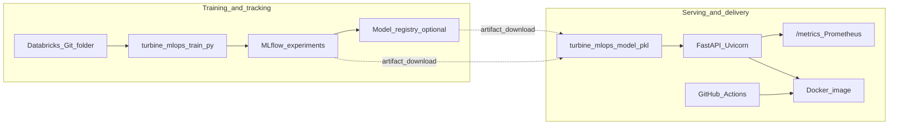

# TurbineMLOps

**Enterprise-style MLOps for predictive engine maintenance (RUL)** ? training and experiment tracking in **Databricks / MLflow**, inference and observability in **FastAPI**, delivery guardrails in **Docker** and **GitHub Actions**.

[](https://github.com/momo-s15/turbine-mlops/actions/workflows/ci.yml)
[](https://www.python.org/downloads/)
[](https://flake8.pycqa.org/)

---

## Executive summary

In aviation and aerospace, **unplanned engine maintenance** drives operational risk, schedule disruption, and cost. **TurbineMLOps** is an end-to-end **Machine Learning Operations (MLOps)** reference implementation that estimates **Remaining Useful Life (RUL)** for turbofan-style assets from sensor telemetry, so teams can reason about **predictive maintenance** before failures surface in operations.

The emphasis is not ?notebook-only data science,? but the **full path from experiment to served software**: reproducible training, **centralized experiment and model lineage** (MLflow on Databricks), a **typed HTTP inference surface** (FastAPI), **containerized** deployment, **automated CI**, and **Prometheus-compatible** runtime metrics. That combination maps directly to how serious ML platforms are built and operated.

---

## Architecture and data flow

Training and serving are **decoupled** so each environment can move at its own cadence while sharing a clear contract (the model artifact and the inference schema).



| Stage | What happens |
|--------|----------------|
| **Data** | Synthetic, **CMAPSS-inspired** sensor streams (e.g. static pressure, core speed) with a physically plausible **RUL** target ? suitable for demos without shipping proprietary datasets. |
| **Train & track** | **Scikit-learn** `RandomForestRegressor`; **RMSE** and parameters logged to **Databricks-managed MLflow**; model serialized for sklearn inference. |
| **Serve** | **FastAPI** validates requests with **Pydantic**, runs inference, returns **RUL**; **Prometheus** client exposes counters and latency histograms at **`/metrics`**. |
| **Ship** | **Docker** image builds a known-good environment; **GitHub Actions** runs **flake8**, **pytest**, and a **Docker build** on every push. |

---

## Technology stack

| Layer | Choices |
|--------|---------|
| **ML** | scikit-learn, pandas, NumPy, joblib |
| **MLOps / tracking** | Databricks, MLflow |
| **API** | FastAPI, Uvicorn, Pydantic |
| **Observability** | prometheus-client |
| **Quality & CI** | pytest, httpx, flake8, GitHub Actions |
| **Containers** | Docker (`python:3.10-slim`) |

---

## Engineering impact (what this repo proves)

- **Environment decoupling** ? Training can run in **Databricks** while inference is packaged for **Docker** / your laptop, mirroring how teams separate experimentation from production paths.
- **ML as software** ? Tests and lint run in **CI**; the API is not an untested script bolted onto a pickle.
- **Operability** ? **Prometheus** instrumentation on the serving path reflects how real platforms watch latency and throughput, not only offline metrics.

---

## Repository layout

| Path | Role |
|------|------|
| `turbine_mlops/` | Shared training code (synthetic data + `train_model`). |
| `train.py` | Local training CLI ? `app/model/turbine_mlops_model.pkl`. |
| `app/main.py` | FastAPI app: `/predict`, `/health`, `/metrics`. |
| `databricks/notebooks/turbine_mlops_train.py` | Databricks notebook: MLflow experiment, `log_model`, optional registry. |
| `.github/workflows/ci.yml` | **TurbineMLOps CI** ? install, flake8, train-for-tests, pytest, Docker build. |
| `Dockerfile` | Installs deps, runs `train.py` at image build, starts **uvicorn**. |

---

## Quick start

**Clone**

```bash
git clone https://github.com/momo-s15/turbine-mlops.git
cd turbine-mlops
```

**Python environment**

```bash
python -m venv .venv
# Windows
.venv\Scripts\activate
# macOS / Linux
source .venv/bin/activate

pip install -r requirements.txt -r requirements-dev.txt
```

**Train (local artifact for API / tests)**

```bash
python train.py
```

**Run the API**

```bash
uvicorn app.main:app --reload --host 127.0.0.1 --port 8000
```

- **Interactive docs:** [http://127.0.0.1:8000/docs](http://127.0.0.1:8000/docs)  
- **Health:** `GET /health`  
- **Predict:** `POST /predict` with JSON `{"sensor_11": 47.5, "sensor_14": 8125.0}`  
- **Metrics:** `GET /metrics`  

**Override model path (optional)**

```bash
set TURBINE_MLOPS_MODEL_PATH=C:\path\to\your_model.pkl
```

*(PowerShell: `$env:TURBINE_MLOPS_MODEL_PATH = "..."`.)*

---

## Docker

```bash
docker build -t turbinemlops:latest .
docker run --rm -p 8000:8000 turbinemlops:latest
```

The container trains a fresh model at **build** time so the image is self-contained for demos.

---

## Databricks workflow (high level)

1. Add this repository as a **Git folder** in Databricks and **pull** updates from `main`.  
2. Open `databricks/notebooks/turbine_mlops_train.py`, attach **compute** (ML-capable cluster or supported serverless where available), **Run all**.  
3. Inspect the run in **Experiments**; download the sklearn **`model.pkl`** if you want to align a local artifact (see note below).  

---

## Tests and CI

```bash
python train.py --n-samples 200 --seed 1
pytest -q
flake8 . --count --select=E9,F63,F7,F82 --show-source --statistics
```

CI mirrors the same discipline on **Ubuntu** with **Python 3.10** and verifies the **Docker** image builds.

---

## Practical note on model pickles

`joblib` / pickle artifacts are **tied to the scikit-learn version** used at train time. For **local + Docker + CI**, run **`python train.py`** with this repo?s pinned stack so the **`.pkl`** matches **inference**. If you import a model trained on a different sklearn minor in Databricks, either **align library versions** end-to-end or **retrain locally** before serving.

The API **reloads the pickle when the file?s modification time changes**, so iterative training does not require manually bouncing the server during development.

---

## Optional local MLflow

```bash
set MLFLOW_TRACKING_URI=http://127.0.0.1:5000
set MLFLOW_EXPERIMENT_NAME=turbine-mlops-local
python train.py
```

---

## License

No license file is bundled by default. Add a `LICENSE` of your choice before redistributing.

---

**Repository:** [github.com/momo-s15/turbine-mlops](https://github.com/momo-s15/turbine-mlops)
